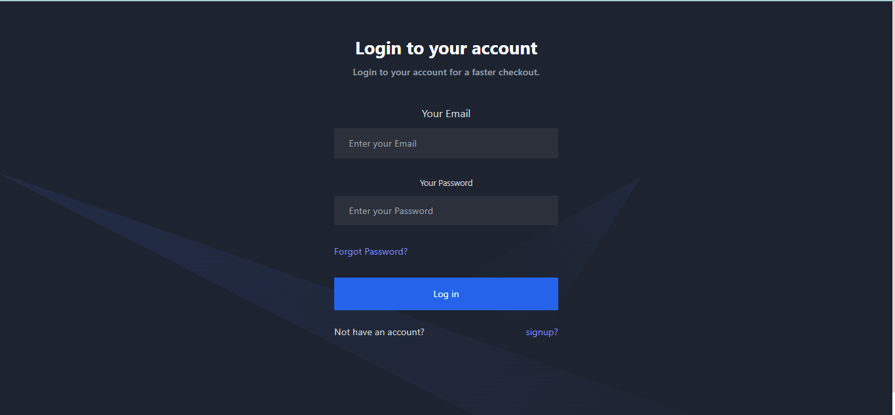
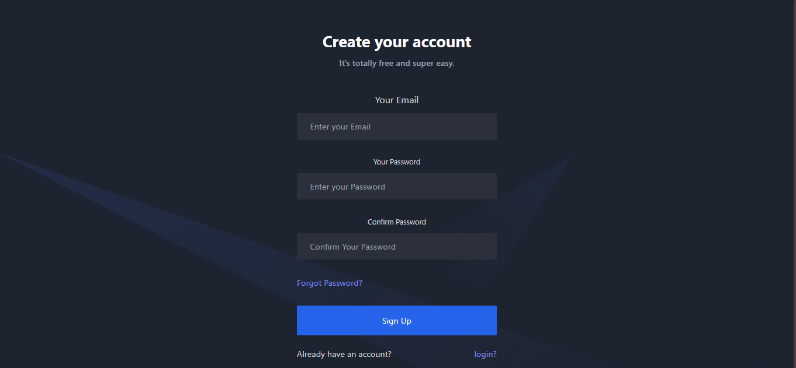

# Nostalgia gallery (A live bidding website )

＝＞Nostalgia gallery is an auction live bidding  Mern Project build on 𝗥𝗲𝗮𝗰𝘁 𝗷𝘀,𝗘𝘅𝗽𝗿𝗲𝘀𝘀.𝗷𝘀 && 𝗡𝗼𝗱𝗲.𝗷𝘀 in backend, Socket.io for real-time interaction ,𝗠𝗼𝗻𝗴𝗼𝗗𝗕 𝗔𝘁𝗹𝗮𝘀 as database & AWS S3 for secure media storage.

＝＞I use 𝗧𝗮𝗶𝗹𝘄𝗶𝗻𝗱 𝗖𝘀𝘀 , 𝗛𝗲𝗿𝗼𝗜𝗰𝗼𝗻𝘀 in frontend.

＝＞I use 𝗦𝘁𝗿𝗶𝗽𝗲 as payment gateway

＝＞ 𝗥𝗲𝗱𝘂𝘅 𝗧𝗼𝗼𝗹𝗸𝗶𝘁 to configure connections between components.

＝＞For strong authentication of login & signup  I use 𝗽𝗮𝘀𝘀𝗽𝗼𝗿𝘁 𝗷𝘀. 

＝＞On reseting password a custom mail will be send to you given email (done by using 𝗡𝗼𝗱𝗲 𝗺𝗮𝗶𝗹𝗲𝗿).

＝＞For a cool spinner use 𝗥𝗲𝗮𝗰𝘁-𝗹𝗼𝗮𝗱𝗲𝗿-𝘀𝗽𝗶𝗻𝗻𝗲𝗿

＝＞For  alert popup use 𝗥𝗲𝗮𝗰𝘁-𝗮𝗹𝗲𝗿𝘁

＝＞For form handle  use 𝗥𝗲𝗮𝗰𝘁-𝗳𝗼𝗿𝗺-𝗵𝗼𝗼𝗸

=>For making a celebration component  use 𝗥𝗲𝗮𝗰𝘁-Confeti

# live 

https://biddingapp-5c495b9e8cc1.herokuapp.com/

# Login Page

# Signup Page

# login signup validation